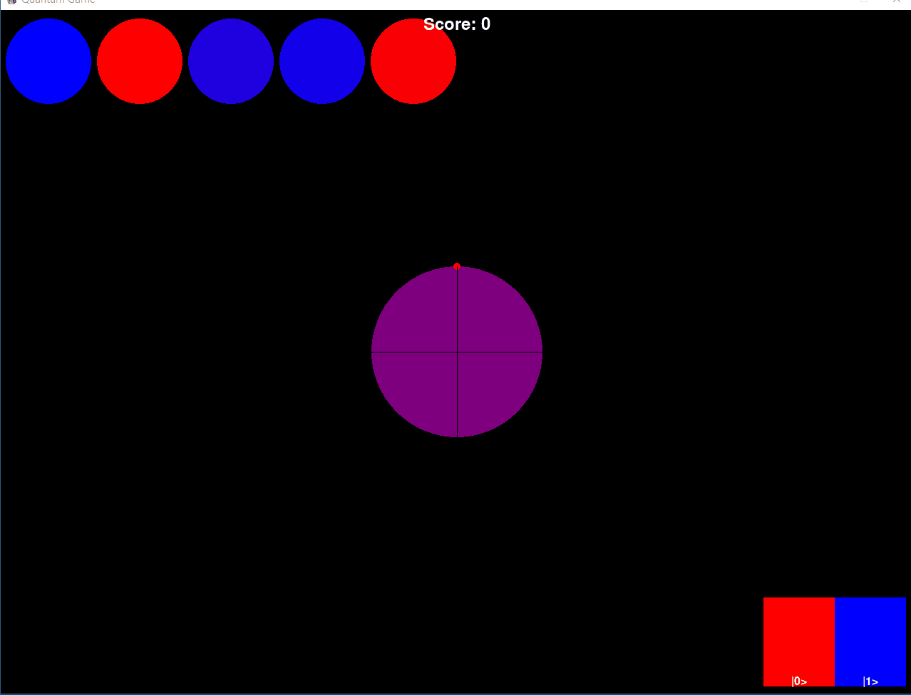

Quantum Invaders
===========

A quantum computing alien invaders game, developed with ChatGPT4.

Match your qubit's color to the enemy colored spheres to save the universe!

[Play Online](https://replit.com/@primaryobjects/Quantum-Invaders)

## Screenshots

## How to Play

The goal of the game is to match your colored sphere with the enemy sphere.

Your sphere will change color according to the rotation of your qubit around the Bloch sphere.

Keyboard actions:

- LEFT: Rotate Ry+
- RIGHT: Rotate Ry-
- UP: Rotate Rx+
- DOWN: Rotate Rx-

Each action rotates the qubit accordingly. As your qubit rotates, the color will adjust according to the measurements of 0 and 1 outcomes from the qubit.

When your sphere matches the same measurement outcome (and color) of an enemy ship, your laser targets the alien and destroys it!

*How many alients can you destroy?*

## License

MIT

## Author

Kory Becker http://www.primaryobjects.com/kory-becker
